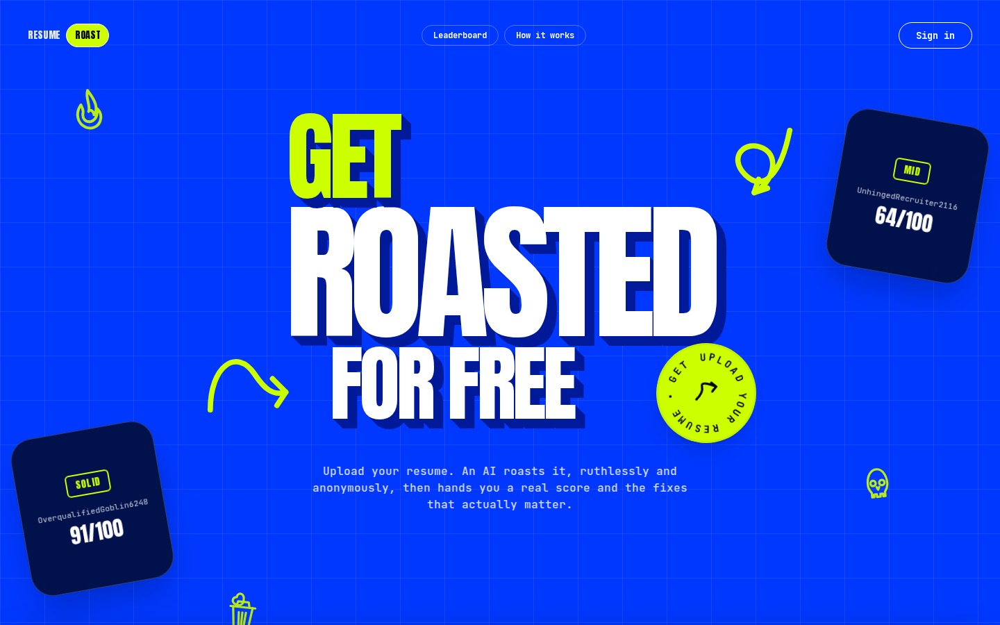
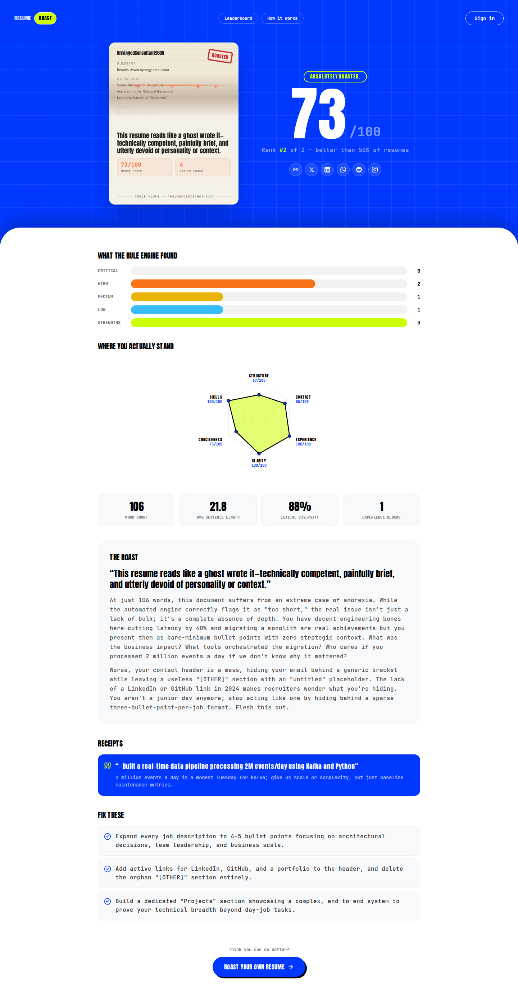

# Resume Roast Arena

Upload your resume, get roasted by an LLM, get an actual score and real fixes. Anonymous by default — sign in if you want your score on the leaderboard.

**Live:** [resume-roast-arena.vercel.app](https://resume-roast-arena.vercel.app)



## What it does

You upload a PDF/DOCX/image of your resume. It gets parsed, anonymized (names, emails, etc. stripped before anything touches an LLM), scored against a rule engine across six categories, and then an LLM writes a roast that's actually grounded in your resume's real content — not generic feedback. You get a score, a radar chart breakdown, specific fixes, and a shareable card.



## How it's built

It's a pipeline, not a monolith. Upload hits a FastAPI backend, which drops the file in blob storage and enqueues it. From there it's six independent workers, each doing one job and passing the baton via Service Bus:

```
ingest → extract (Tika) → normalize → anonymize → score → roast (Gemini) → render
```

Each stage is stateless and retry-safe. If a worker dies mid-job, the next run just picks it back up. The renderer runs a real headless Chromium instance to produce the shareable card image (the one above the roast text).

Deployed on Azure Container Apps, with the pipeline workers scaling to zero when idle and spinning up on demand — no idle compute cost for a pipeline that mostly sits empty between uploads. Frontend is Next.js on Vercel.

**Stack:** FastAPI, Postgres, Redis, Azure Service Bus + Blob Storage, Apache Tika, Gemini, Playwright, Next.js, Firebase Auth.

## Running it locally

```bash
# infra (postgres/redis/azurite/tika/service bus emulator)
cd backend && docker compose up -d

# backend
source venv/bin/activate
cd backend && uvicorn app:app --reload

# workers (each in its own terminal, from repo root)
python -m workers.extraction.main
python -m workers.normalization.main
python -m workers.anonymization.main
python -m workers.scoring.main
python -m workers.llm.main
python -m workers.renderer.main

# frontend
cd frontend && npm run dev
```

You'll need real Postgres/Redis/Blob/Service Bus/Gemini credentials in `.env` files under `backend/src/` and `workers/` (see `frontend/.env.example` for the frontend's own env vars).

## CI/CD

Every push runs the full test suite. Merges to `main` build and push both Docker images and roll all 8 Container Apps to the new revision, authenticated to Azure via OIDC (no stored cloud credential).
